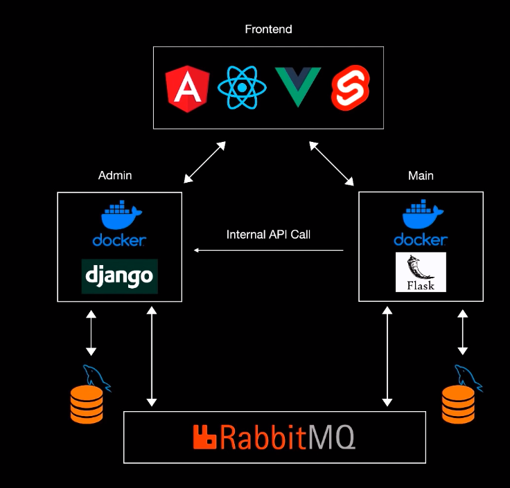

ref: https://www.youtube.com/watch?v=0iB5IPoTDts&t=7353s



本地运行需要：

* 后端

  启动本地Mysql数据库，其中包含admin_db以及main_db

  在admin文件夹中

  ```
  python manage.py runserver
  
  python consumer.py
  ```

  在main文件夹中

  ```
  python manager.py runserver
  
  python consumer.py
  ```

  `注：有时候即使成功运行，在进行delete等操作的时候，管道还是会接收不到消息甚至报错`

* 前端

  ```
  npm install
  
  npm start
  ```

  `注：前端数据来源于后端数据库，运行时需要保证后端开启`